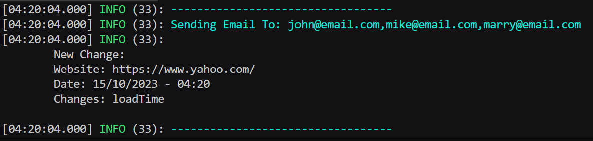

### Behzad Barzin (Behzad_Barzin@live.com)
# How To Run
- Run: ```docker-compose up```
- Wait for a few minutes (~10 Minutes) for the cron-job to execute and get website changes (at first it'll only get the initial state)
- Go to ```localhost:3000``` and use the app
- Go to ```localhost:8081``` to browse the MongoDB Database

# Containers
- ```backend```: Provides access to backend api through port ```1400```
- ```frontend```: Runs the react application (frontend) on port ```3000```
- ```mongo```: The MongoDB instance
- ```mongo-express```: Let's us access and view the db
  - Credentials:
    - username: `admin`
    - password: `admin`

# Todo
- ✅ User Management (User WatchList)
- ✅ Change Detector
- ✅ Display Changes
### In Progress
- ⚒️ Email Notifier (`./backend/src/notifiers/email_notifier.ts`)
  - Prints the content of the email to the console
    
  - Environment Variables must be set:
    - `SENDGRID_API_KEY`: SendGrid API Key
    - `FROM_EMAIL`: Sender Email Address
### Next Steps
- ⏸️ Write Automated Tests

